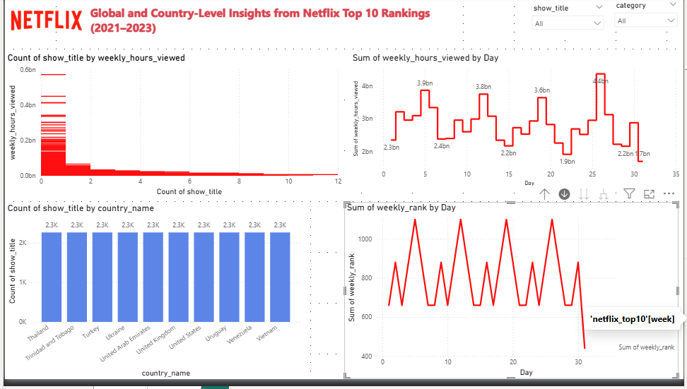

# 📊 Netflix Top 10 Power BI Dashboard (2021–2023)

This project presents a comprehensive Power BI analysis of **Netflix's Top 10 rankings** from 2021 to 2023, covering both **global** and **country-specific** trends. The dashboard explores viewing patterns, genre preferences, title rankings, and more, offering insights into how Netflix content performs around the world.

---

## 📥 Download the Power BI Report

🔗 Click below to download the `.pbix` file and explore the interactive visuals:

👉 [NETFLIX TOP 10 ANALYSIS.pbix](https://github.com/Filometer/Netflix-Top10-PowerBI/blob/main/NETFLIX%20TOP%2010%20ANALYSIS.pbix?raw=true)

---

## 🖼️ Dashboard Preview

---

## 🔍 Key Insights from the Dashboard

- 🎬 **Top Global Titles** by Total Viewing Hours  
- 🌍 **Country-Level Rankings** and Viewership Patterns  
- 🗓️ **Weekly Viewing Trends** across Categories  
- 📈 **Ranking Progression Over Time** for Trending Titles  
- 📊 Comparison of **TV Series vs Movies**  
- 🏆 Titles with the **Most Cumulative Weeks** in Top 10  
- 📍 Most Watched Content by Country

---

## 🧰 Tools & Technologies Used

- **Power BI Desktop** – Data Modeling, Visualizations  
- **Excel** – Data Cleaning and Preparation  
- **Netflix Top 10 Dataset** – From [Top10.Netflix.com](https://top10.netflix.com/) (2021–2023)

---

## 📂 Project Structure

| File | Description |
|------|-------------|
| `NETFLIX TOP 10 ANALYSIS.pbix` | Main Power BI dashboard file |
| `dashboard.png` | Screenshot of the main report page |
| `netflix_top10.csv` | Global top 10 dataset |
| `netflix_top10_country.csv` | Country-level top 10 dataset |

---

## ✍️ Author

**Amoo Samuel Akinkunmi**  
📧 Email: [Filometer95@gmail.com](mailto:Filometer95@gmail.com)  
🔗 LinkedIn: [linkedin.com/in/amoo-samuel-akinkunmi2022](https://www.linkedin.com/in/amoo-samuel-akinkunmi2022)  
📁 GitHub: [github.com/Filometer](https://github.com/Filometer)

---

## 🏷️ Tags

`Power BI` `Data Analysis` `Netflix` `Business Intelligence` `Dashboard` `Global Trends` `DAX` `Country Analysis`

